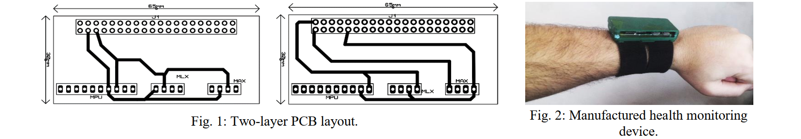

# IoT Smart Wearable Health Monitor

[](https://github.com/abdelrahman-fawaz18/iot-smart-wearable-health-monitor/actions/workflows/ci.yml)

Raspberry Pi software and project data for a wrist-worn health-monitoring research prototype developed at Egypt-Japan University of Science and Technology. The system combines inertial, infrared temperature, and optical sensors on a shared I2C bus, with CSV acquisition and Node-RED visualization.


## System design

The published device uses a Raspberry Pi Zero W as the acquisition and communication controller. Sensor readings are timestamped, written to local CSV files, and made available to Node-RED for processing and browser-based monitoring.

| Component | Role | Repository implementation |
| --- | --- | --- |
| MPU9250 | Nine-axis motion sensing | Supported through `mpu9250-jmdev` |
| MPU6050 | Six-axis motion sensing used in the project recordings | Built-in register-level backend |
| MLX90614 | Ambient and object temperature | Built-in register-level backend |
| MAX30100 | Red and infrared photoplethysmography | Raw FIFO acquisition |
| Raspberry Pi Zero W | Sampling, storage, and communication | Python command-line collector |
| Node-RED | Flow processing and browser visualization | Project flow documentation and screenshots |

## Prototype hardware



The custom two-layer interconnect board routes the shared I2C bus between the Raspberry Pi header, motion sensor, temperature sensor, and optical sensor. The assembled electronics are enclosed in a wrist-mounted housing with the sensing surface positioned against the inner wrist.

Hardware addresses, wiring, and backend configuration are documented in [docs/hardware.md](docs/hardware.md).

## Software

The maintained package separates hardware access, sensor models, acquisition control, and CSV serialization:

- `hardware.py` implements the MPU6050, MPU9250, MLX90614, and MAX30100 interfaces.
- `collector.py` coordinates sampling, moving averages, and output records.
- `models.py` defines the typed measurement and CSV schemas.
- `cli.py` provides the `wearable-monitor` command.

Install the development and Raspberry Pi hardware dependencies:

```bash
python -m venv .venv
source .venv/bin/activate
python -m pip install -e ".[dev,hardware]"
pytest
```

Start a recording with the MPU6050 and MLX90614 backends:

```bash
wearable-monitor --imu mpu6050 --output recordings/session.csv
```

Select the MPU9250 backend for the published IMU configuration:

```bash
wearable-monitor --imu mpu9250 --output recordings/session.csv
```

The optional `--max30100` flag adds raw red and infrared PPG channels to the output record.

## Project data

Eight walking recordings and one temperature capture are included under `data/recordings`. The figure below presents the 1,993-sample `M01_L_Wlk_Mlt.csv` trial over a continuous 92.9-second interval. The temperature panel begins after the logger's two-sample moving-average initialization.


Generate the figure directly from the source CSV:

```bash
python scripts/plot_recording.py \
  data/recordings/walking/M01_L_Wlk_Mlt.csv \
  docs/assets/walking-recording.svg
```

Column definitions and file-level notes are provided in [docs/data.md](docs/data.md).

## Repository structure

```text
.
|-- src/wearable_monitor/   acquisition package
|-- tests/                  hardware-independent unit tests
|-- data/recordings/        project sensor recordings
|-- scripts/                reproducible data-visualization tools
|-- docs/                   hardware, data, and integration documentation
|-- docs/assets/            device figures, diagrams, and generated plots
`-- legacy/                 original project scripts retained for reference
```

## Documentation

- [Hardware and wiring](docs/hardware.md)
- [Data files and schema](docs/data.md)
- [Node-RED integration](docs/node-red.md)
- [Source inventory](docs/source-inventory.md)
- [Original script notes](legacy/README.md)

## Publication

A. M. Elsayed, A. M. Ghuniem, M. A. Khafagy, and M. A. M. El-Bendary, “An IoT-based Smart Wearable System for Remote Health Monitoring,” *2021 International Japan-Africa Conference on Electronics, Communications and Computations (JAC-ECC)*, 2021. [https://doi.org/10.1109/JAC-ECC54461.2021.9691431](https://doi.org/10.1109/JAC-ECC54461.2021.9691431)

The publication PDF is not distributed with this repository. Copyright and usage terms are stated in [NOTICE.md](NOTICE.md).
