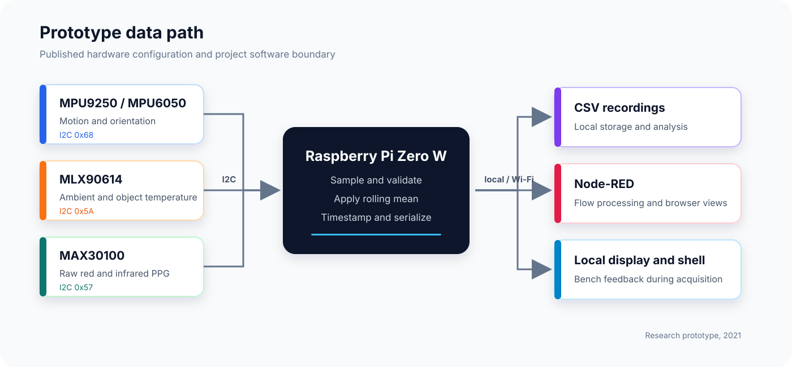
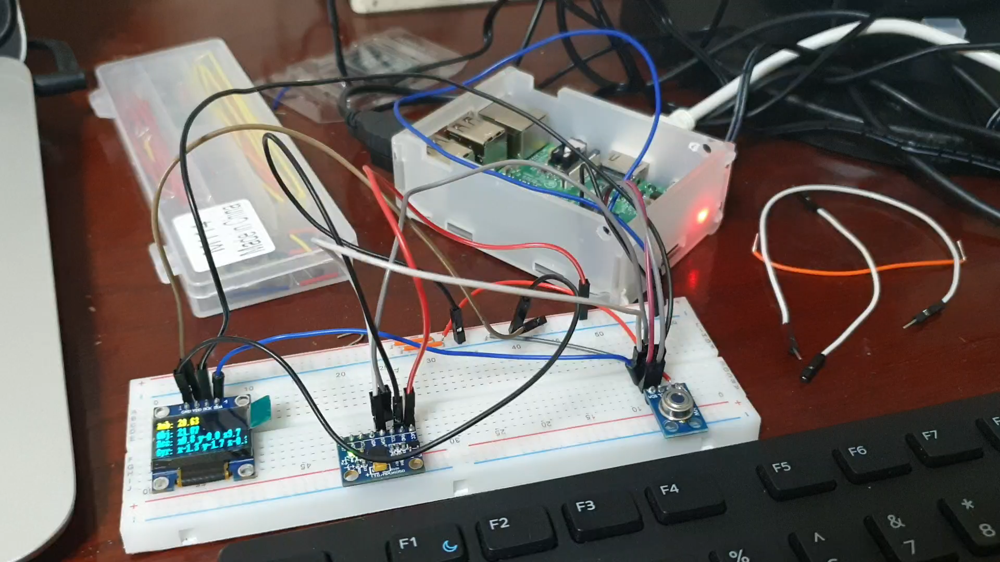
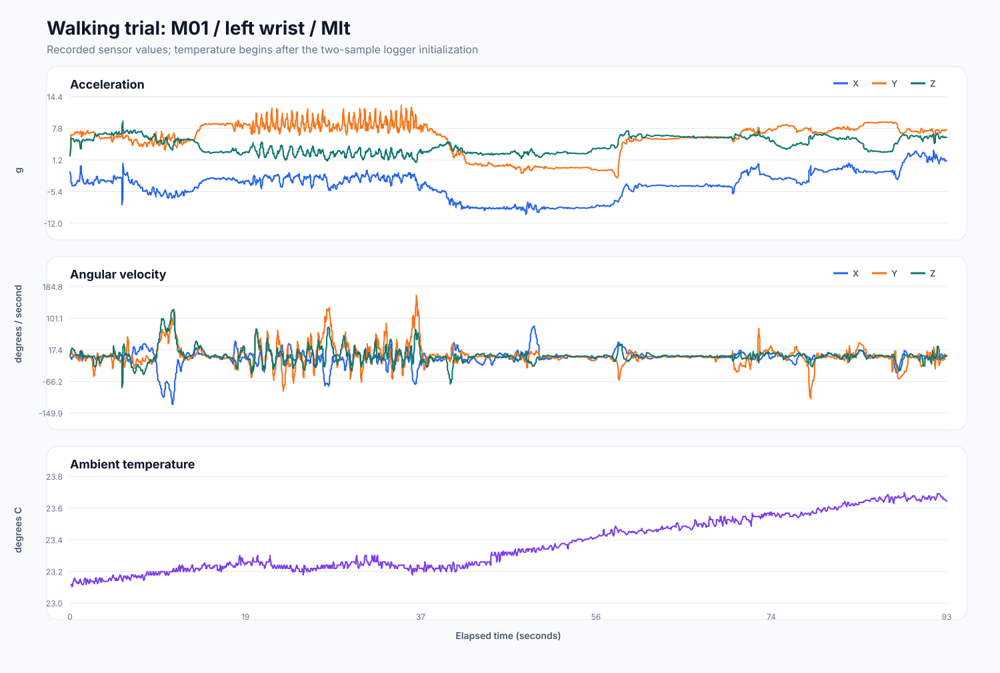

# IoT Smart Wearable Health Monitor

Research prototype for collecting movement and temperature signals on a Raspberry Pi and forwarding the resulting records to an IoT visualization layer. The work began as an undergraduate graduation project at Egypt-Japan University of Science and Technology in 2021.



## Project status

This repository is a cleaned engineering archive, not a production medical device. It combines the surviving source code and recordings with a maintainable data-acquisition package. The reconstruction stays within the demonstrated scope of the original prototype.

| Area | Recovered evidence | Repository status |
| --- | --- | --- |
| Raspberry Pi acquisition | Python loggers for motion and temperature | Refactored and covered by hardware-independent tests |
| Motion sensing | Integrated MPU6050 recordings; later MPU9250 acquisition code | Both backends are documented; MPU6050 remains the default because it produced the archived recordings |
| Temperature | MLX90614 integration and captured readings | Supported in the collector |
| Pulse oximetry | MAX30100 register reader and an experimental console test | Raw red/IR capture only; no unverified BPM or SpO2 conversion is presented |
| Node-RED | Screenshots of the working temperature and IMU flows | Flow export was not recovered, so the original deployment cannot be imported directly |
| PCB | Raster layouts in the publication source | Manufacturing files, schematics, Gerbers, and bill of materials are missing |
| Prototype data | Eight anonymized walking recordings and one temperature capture | Preserved under `data/recordings` |

The publication PDF is intentionally excluded. See the [published paper](https://doi.org/10.1109/JAC-ECC54461.2021.9691431) for the full system description.

## Hardware represented here

- Raspberry Pi Zero W running Raspberry Pi OS
- MPU9250 nine-axis IMU in the paper design
- MPU6050 six-axis IMU in the recovered integrated prototype
- MLX90614 infrared temperature sensor
- MAX30100 optical pulse-oximetry sensor
- Optional SSD1306 OLED used during bench testing
- Node-RED for local collection and browser-based visualization

The sensors share the Raspberry Pi I2C bus. Confirm each breakout board's supply and logic levels before wiring it. The Raspberry Pi GPIO is not 5 V tolerant.

## Recovered prototype



This bench setup produced the surviving motion and temperature recordings. It shows the Raspberry Pi, OLED, MPU6050, and MLX90614 before the planned custom PCB and wrist enclosure.

## Quick start

The tests and plotting tool run on any development machine. Live collection requires Linux I2C access on a Raspberry Pi.

```bash
python -m venv .venv
source .venv/bin/activate
python -m pip install -e ".[dev,hardware]"
pytest
```

Enable I2C on the Raspberry Pi, verify that the devices appear, then start a recording:

```bash
sudo raspi-config
i2cdetect -y 1
wearable-monitor --imu mpu6050 --output recordings/session.csv
```

Use the paper-era IMU backend when an MPU9250 is installed:

```bash
wearable-monitor --imu mpu9250 --output recordings/session.csv
```

Add `--max30100` to record raw photoplethysmography channels. The command does not report heart rate or oxygen saturation because the surviving project files do not contain a validated conversion pipeline.

## Recorded data



The archived walking files contain acceleration, angular velocity, and ambient temperature. They retain their original names and values. The plot above is generated from `M01_L_Wlk_Sgl.csv`:

```bash
python scripts/plot_recording.py \
  data/recordings/walking/M01_L_Wlk_Sgl.csv \
  docs/assets/walking-recording.svg
```

See [data documentation](docs/data.md) for the schema and known quality issues.

## Repository layout

```text
.
|-- src/wearable_monitor/   maintained acquisition package
|-- tests/                  tests that use simulated I2C and sensor inputs
|-- data/recordings/        recovered, anonymized prototype recordings
|-- scripts/                reproducible plotting utility
|-- docs/                   hardware, data, cloud, and recovery notes
|-- docs/assets/            diagrams, prototype evidence, and generated plots
`-- legacy/                 selected original team-authored scripts
```

## Documentation

- [Hardware and wiring](docs/hardware.md)
- [Data files and schema](docs/data.md)
- [Node-RED evidence](docs/node-red.md)
- [Recovery audit and exclusions](docs/recovery-audit.md)
- [Legacy source notes](legacy/README.md)

## Important limitations

The prototype was built for research and teaching. It has not undergone medical-device verification, clinical validation, electrical safety testing, or regulatory review. Do not use it for diagnosis, treatment, alarms, or safety-critical monitoring.

The repository does not include an open-source license. Source and data are available for review; no permission to redistribute or reuse them is implied. The conference paper remains subject to its publisher's terms.
