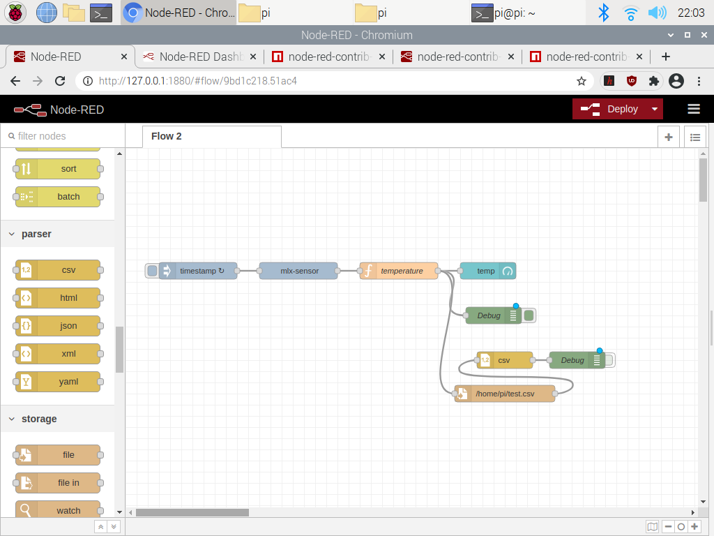

# Node-RED integration

The prototype used Node-RED on the Raspberry Pi for sensor triggering, debug output, CSV export, and browser-based monitoring.

The recovered screenshots show the following path:

1. An inject node supplies the sampling timestamp.
2. An MLX90614 input node reads object and ambient temperature.
3. A function node formats the payload.
4. The output feeds dashboard, debug, CSV, and file nodes.

Later screenshots also show MPU6050 data being formatted and sent to an MQTT output node. The broker address visible in those screenshots belonged to the temporary laboratory network and is intentionally not carried into the cleaned implementation.

## Recovery limitation

No Node-RED flow export, package manifest, broker configuration, or dashboard source survived. The screenshot is included as implementation evidence only. A new flow could be built from the maintained CSV collector, but doing so would be a new implementation rather than recovery of the 2021 system.
